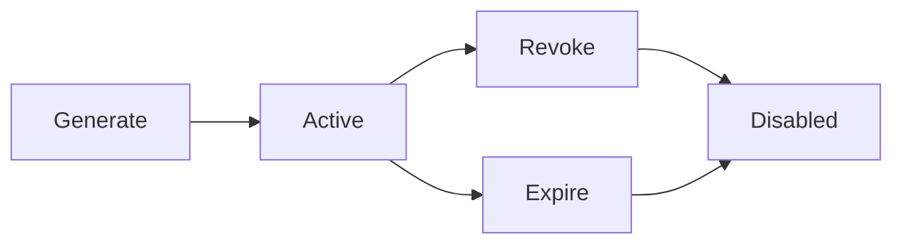

## Overview

HOST Pay uses **API Key authentication** for all API requests. Each application has separate credentials for Test Mode and Live Mode to ensure secure development and production workflows.

## API Credentials

Every application has two sets of credentials:

<CardGroup cols={2}>
  <Card title="Test Mode Credentials" icon="flask">
    For development and testing - uses sandbox services
  </Card>
  <Card title="Live Mode Credentials" icon="circle-check">
    For production - processes real transactions
  </Card>
</CardGroup>

Each credential set consists of:
- **API Key**: Identifies your application
- **Secret Key**: Authenticates your requests

<Warning>
  **Never** expose your secret keys in client-side code, public repositories, or logs. Always keep them secure on your server.
</Warning>

## Making Authenticated Requests

Include both keys in the request headers:

<CodeGroup>

```bash cURL
curl --request GET \
  --url https://hpay-api.host-sl.com/api/v1/users/ \
  --header 'api-key: YOUR_API_KEY' \
  --header 'secret-key: YOUR_SECRET_KEY'
```

```python Python
import requests

headers = {
    "api-key": "YOUR_API_KEY",
    "secret-key": "YOUR_SECRET_KEY"
}

response = requests.get(
    "https://hpay-api.host-sl.com/api/v1/users/",
    headers=headers
)
```

```javascript JavaScript
const headers = {
  'api-key': 'YOUR_API_KEY',
  'secret-key': 'YOUR_SECRET_KEY'
};

fetch('https://hpay-api.host-sl.com/api/v1/users/', {
  method: 'GET',
  headers: headers
});
```

```php PHP
<?php
$headers = [
    "api-key: YOUR_API_KEY",
    "secret-key: YOUR_SECRET_KEY"
];

curl_setopt($curl, CURLOPT_HTTPHEADER, $headers);
?>
```

</CodeGroup>

## Credential Management

### Generating Credentials

<Steps>
  <Step title="Access Dashboard">
    Log in to the HOST Pay dashboard
  </Step>
  <Step title="Select Application">
    Navigate to your application
  </Step>
  <Step title="Credentials Section">
    Go to the API Credentials section
  </Step>
  <Step title="Generate Keys">
    Click "Generate New Credential" for Test or Live mode
  </Step>
</Steps>

### Credential Lifecycle



- **Active**: Credential is valid and can authenticate requests
- **Disabled**: Credential has been revoked and cannot be used
- **Expired**: Credential has reached its expiration date (if set)

### Best Practices

<AccordionGroup>
  <Accordion title="Use Environment Variables">
    Store credentials in environment variables, never hardcode them:
    
    ```bash
    export HOST_PAY_API_KEY="your_api_key"
    export HOST_PAY_SECRET_KEY="your_secret_key"
    ```
    
    ```python
    import os
    
    api_key = os.getenv("HOST_PAY_API_KEY")
    secret_key = os.getenv("HOST_PAY_SECRET_KEY")
    ```
  </Accordion>

  <Accordion title="Rotate Keys Regularly">
    Generate new credentials periodically and revoke old ones:
    
    1. Generate new credentials
    2. Update your application
    3. Test with new credentials
    4. Revoke old credentials
  </Accordion>

  <Accordion title="Use Different Keys Per Environment">
    Maintain separate credentials for:
    - Development
    - Staging
    - Production
  </Accordion>

  <Accordion title="Monitor Credential Usage">
    Check the `last_used` timestamp in the dashboard to identify unused or compromised credentials.
  </Accordion>
</AccordionGroup>

## Security Considerations

### Do's ✅

- ✅ Store credentials in environment variables
- ✅ Use HTTPS for all API requests
- ✅ Rotate keys regularly
- ✅ Revoke compromised keys immediately
- ✅ Use separate credentials per environment
- ✅ Monitor credential usage

### Don'ts ❌

- ❌ Commit keys to version control
- ❌ Share keys via email or chat
- ❌ Log keys in application logs
- ❌ Use production keys in development
- ❌ Expose keys in client-side code
- ❌ Reuse keys across applications

## Handling Authentication Errors

### 401 Unauthorized

This error occurs when credentials are missing or invalid:

```json
{
  "detail": "Invalid application credentials"
}
```

**Common causes:**
- Missing `api-key` or `secret-key` header
- Incorrect credential values
- Using revoked credentials
- Using expired credentials

**Solution:**
- Verify your credentials in the dashboard
- Check for typos in the header names
- Ensure credentials haven't been revoked

### 403 Forbidden

This error occurs when you don't have permission:

```json
{
  "detail": "You do not have permission to access this resource"
}
```

**Common causes:**
- Trying to access resources from another application
- Using test credentials to access live resources (or vice versa)
- Accessing admin-only endpoints with application credentials

**Solution:**
- Use the correct credentials for the environment
- Verify you're accessing resources in your application's schema

## Example: Complete Authentication Flow

The official [SDKs](/sdks) handle authentication for you — set your credentials
once and every request carries the right headers:

<CodeGroup>

```python Python
import os
from hostpay import HostPay

client = HostPay(
    api_key=os.environ["HOSTPAY_API_KEY"],
    secret_key=os.environ["HOSTPAY_SECRET_KEY"],
)

user = client.users.create(
    app_user_id="user_1002",
    name="Jane Doe",
    email="jane@example.com",
    phone_number="+23279123456",
)
print(f"Created user: {user['id']}")
```

```typescript TypeScript
import { HostPay } from "@hostpay/sdk";

const client = new HostPay({
  apiKey: process.env.HOSTPAY_API_KEY!,
  secretKey: process.env.HOSTPAY_SECRET_KEY!,
});

const user = await client.users.create({
  appUserId: "user_1002",
  name: "Jane Doe",
  email: "jane@example.com",
  phoneNumber: "+23279123456",
});
console.log(`Created user: ${user.id}`);
```

</CodeGroup>

Invalid or missing credentials raise a typed `AuthenticationError` (HTTP 401 or
403) with the status code and API detail attached, so authentication failures
are distinguishable from validation or server errors.

## Testing Authentication

You can verify your credentials are working:

<CodeGroup>

```bash cURL
curl --request GET \
  --url https://hpay-api.host-sl.com/api/v1/users/ \
  --header 'api-key: YOUR_API_KEY' \
  --header 'secret-key: YOUR_SECRET_KEY'
```

```python Python
import requests

def test_credentials(api_key, secret_key):
    headers = {
        "api-key": api_key,
        "secret-key": secret_key
    }
    
    try:
        response = requests.get(
            "https://hpay-api.host-sl.com/api/v1/users/",
            headers=headers
        )
        response.raise_for_status()
        print("✅ Credentials are valid!")
        return True
    except requests.exceptions.HTTPError as e:
        if e.response.status_code == 401:
            print("❌ Invalid credentials")
        else:
            print(f"❌ Error: {e}")
        return False

# Test your credentials
test_credentials("YOUR_API_KEY", "YOUR_SECRET_KEY")
```

</CodeGroup>

## Need Help?

If you're experiencing authentication issues:

<CardGroup cols={2}>
  <Card
    title="Check Credentials"
    icon="key"
  >
    Verify your credentials in the dashboard
  </Card>
  <Card
    title="Contact Support"
    icon="life-ring"
    href="mailto:support@hostpay.com"
  >
    Reach out if issues persist
  </Card>
</CardGroup>

