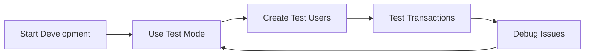
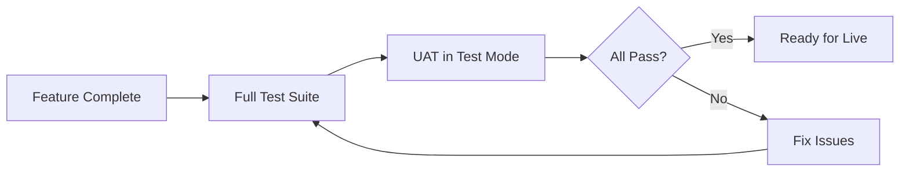
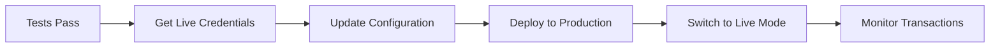
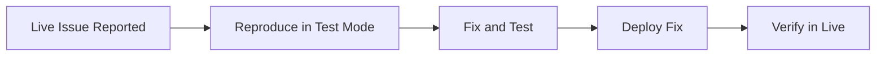

## Overview

HOST Pay provides **two separate environments** for every application to ensure safe development and testing without affecting production data.

<CardGroup cols={2}>
  <Card title="Test Mode" icon="flask" color="#3B82F6">
    Sandbox environment for development and testing
  </Card>
  <Card title="Live Mode" icon="circle-check" color="#10B981">
    Production environment for real transactions
  </Card>
</CardGroup>

## Key Differences

| Feature          | Test Mode            | Live Mode               |
| ---------------- | -------------------- | ----------------------- |
| **Credentials**  | Test API keys        | Live API keys           |
| **Database**     | Separate test schema | Separate live schema    |
| **Stripe**       | Stripe Test Mode     | Stripe Live Mode        |
| **Mobile Money** | Mock Monime Service  | Real Monime API         |
| **Real Money**   | No real money        | Real transactions       |
| **Webhooks**     | Test webhook URLs    | Production webhook URLs |

## Test Mode

### What is Test Mode?

Test Mode is a complete sandbox environment that mirrors Live Mode functionality without processing real money or making real API calls to payment providers.

### Features

<AccordionGroup>
  <Accordion title="Mock Payment Services">
    - **Mock Monime Service**: Simulates mobile money without real transactions
    - **Stripe Test Mode**: Uses Stripe's test cards and API
    - All payment responses mirror real API structures
  </Accordion>

{" "}

<Accordion title="Isolated Data">
  - Completely separate database schema - Test data never mixes with production
  data - Safe to experiment and delete data
</Accordion>

{" "}

<Accordion title="Full API Access">
  - All API endpoints available - Same rate limits as Live Mode - Webhook events
  triggered normally
</Accordion>

  <Accordion title="Testing Tools">
    - Simulate successful and failed payments
    - Test edge cases and error handling
    - Debug without risk
  </Accordion>
</AccordionGroup>

### Using Test Mode

Simply use your Test Mode credentials:

```python
# Test Mode Configuration
test_credentials = {
    "api_key": "test_ak_1234567890abcdef",
    "secret_key": "test_sk_abcdef1234567890"
}

# All requests will use Test Mode
response = requests.post(
    "https://hpay-api.host-sl.com/api/v1/users/create/",
    headers={
        "api-key": test_credentials["api_key"],
        "secret-key": test_credentials["secret_key"]
    },
    json=user_data
)
```

### Test Mode Indicators

<Note>
  Resources created in Test Mode will have `"live_mode": false` in their
  response.
</Note>

```json
{
  "id": "user_test_abc123",
  "name": "Test User",
  "email": "test@example.com",
  "live_mode": false, // ← Indicates Test Mode
  "created_at": "2025-01-16T10:00:00Z"
}
```

## Live Mode

### What is Live Mode?

Live Mode is the production environment where real transactions are processed, real money moves, and actual API calls are made to payment providers.

<Warning>
  **Use Live Mode with caution!** All transactions in Live Mode involve real
  money and cannot be easily reversed.
</Warning>

### Features

- **Real Transactions**: Actual money transfers
- **Live Payment Providers**: Real Stripe and Monime APIs
- **Production Database**: Separate live schema
- **Real Webhooks**: Events sent to production URLs
- **Compliance**: Full regulatory compliance required

### Using Live Mode

Use your Live Mode credentials:

```python
# Live Mode Configuration
live_credentials = {
    "api_key": "live_ak_0987654321fedcba",
    "secret_key": "live_sk_fedcba0987654321"
}

# All requests will use Live Mode
response = requests.post(
    "https://hpay-api.host-sl.com/api/v1/users/create/",
    headers={
        "api-key": live_credentials["api_key"],
        "secret-key": live_credentials["secret_key"]
    },
    json=user_data
)
```

### Live Mode Indicators

```json
{
  "id": "user_live_xyz789",
  "name": "Real Customer",
  "email": "customer@example.com",
  "live_mode": true, // ← Indicates Live Mode
  "created_at": "2025-01-16T10:00:00Z"
}
```

## Switching Between Environments

### Environment Selection

The environment is automatically determined by which credentials you use:

```python
from hostpay import HostPay

# Test Mode — test keys hit the isolated test schema and mock providers
test_client = HostPay(
    api_key="test_ak_123",
    secret_key="test_sk_456",
)

# Live Mode — live keys hit the live schema and real providers
live_client = HostPay(
    api_key="live_ak_789",
    secret_key="live_sk_012",
)
```

There is no environment flag to set — the key prefix (`test_` / `live_`) is the
only switch. The same code runs in both modes.

### Configuration Management

<Tabs>
  <Tab title="Environment Variables">
    ```bash
    # .env.development
    HOST_PAY_API_KEY=test_ak_1234567890abcdef
    HOST_PAY_SECRET_KEY=test_sk_abcdef1234567890
    HOST_PAY_ENV=test

    # .env.production
    HOST_PAY_API_KEY=live_ak_0987654321fedcba
    HOST_PAY_SECRET_KEY=live_sk_fedcba0987654321
    HOST_PAY_ENV=live
    ```

  </Tab>
  
  <Tab title="Config Class">
    ```python
    import os
    
    class Config:
        def __init__(self, env="test"):
            self.env = env
            
            if env == "live":
                self.api_key = os.getenv("HOST_PAY_LIVE_API_KEY")
                self.secret_key = os.getenv("HOST_PAY_LIVE_SECRET_KEY")
            else:
                self.api_key = os.getenv("HOST_PAY_TEST_API_KEY")
                self.secret_key = os.getenv("HOST_PAY_TEST_SECRET_KEY")
    
    # Usage
    test_config = Config("test")
    live_config = Config("live")
    ```
  </Tab>
  
  <Tab title="JSON Config">
    ```json
    {
      "test": {
        "api_key": "test_ak_1234567890abcdef",
        "secret_key": "test_sk_abcdef1234567890",
        "webhook_url": "https://test.example.com/webhooks"
      },
      "live": {
        "api_key": "live_ak_0987654321fedcba",
        "secret_key": "live_sk_fedcba0987654321",
        "webhook_url": "https://example.com/webhooks"
      }
    }
    ```
  </Tab>
</Tabs>

## Testing Best Practices

<Steps>
  <Step title="Develop in Test Mode">
    Build and test all features using Test Mode credentials
  </Step>
  <Step title="Test Edge Cases">
    Simulate failures, errors, and unusual scenarios
  </Step>
  <Step title="Verify Webhooks">
    Ensure webhook handlers work correctly in Test Mode
  </Step>
  <Step title="Conduct UAT">Perform user acceptance testing in Test Mode</Step>
  <Step title="Switch to Live">
    Only move to Live Mode after thorough testing
  </Step>
  <Step title="Monitor Carefully">
    Watch Live Mode closely during initial rollout
  </Step>
</Steps>

## Payment Provider Modes

### Stripe

<Tabs>
  <Tab title="Test Mode">
    **Test Cards** (always work): - `4242 4242 4242 4242` - Visa (succeeds) -
    `4000 0000 0000 0002` - Visa (card declined) - `4000 0000 0000 9995` - Visa
    (insufficient funds) Use any future expiry date and any 3-digit CVC.
  </Tab>

  <Tab title="Live Mode">
    Real credit/debit cards are charged. Actual money is processed.
    **Requirements:** - Valid Stripe account - Business verification completed -
    Bank account connected for payouts
  </Tab>
</Tabs>

### Monime (Mobile Money)

<Tabs>
  <Tab title="Test Mode">
    **MockMonimePaymentService** provides:
    - Simulated USSD codes
    - Instant payment confirmation (for testing)
    - No real mobile money transactions
    - Predictable responses
    
    Example response:
    ```json
    {
      "ussdCode": "*715*1234567890#",
      "status": "pending"
    }
    ```
  </Tab>
  
  <Tab title="Live Mode">
    Real Monime API:
    - Actual USSD codes sent to customers
    - Real mobile money deductions
    - Integration with Sierra Leone telecom providers
    - Webhook notifications for payment status
  </Tab>
</Tabs>

## Common Scenarios

### Scenario 1: Initial Development



**Use Test Mode** for all initial development work.

### Scenario 2: Pre-Production Testing



**Stay in Test Mode** until all tests pass.

### Scenario 3: Going Live



**Switch to Live Mode** only after thorough testing.

### Scenario 4: Debugging Production



**Use Test Mode** to safely reproduce and fix issues.

## Checklist: Going Live

Before switching to Live Mode, ensure:

<Checklist>
  - [ ] All features tested thoroughly in Test Mode - [ ] Error handling
  implemented and tested - [ ] Webhook endpoints secured and tested - [ ]
  Sensitive data properly handled - [ ] Rate limiting and retry logic
  implemented - [ ] Monitoring and logging configured - [ ] Team trained on Live
  Mode procedures - [ ] Rollback plan prepared - [ ] Live credentials secured
  (not in code) - [ ] Customer support process defined
</Checklist>

## Need Help?

<CardGroup cols={2}>
  <Card title="Testing Guide" icon="flask" href="/guides/testing">
    Learn how to test effectively in Test Mode
  </Card>
  <Card title="Support" icon="life-ring" href="mailto:support@hostpay.com">
    Questions about going live? Contact us
  </Card>
</CardGroup>
